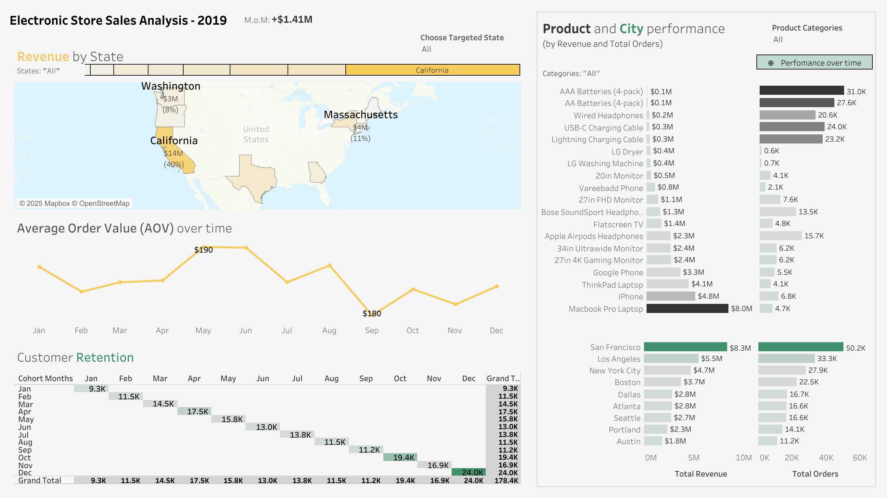
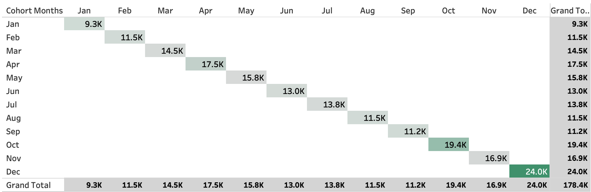

# Electronics-Store Sales Analysis - 2019


## Table of content
- [Project Background](#project-background)
- [Data Structure](#data-structure)
  - [Repo Structure](#repo-structure)
- [Executive Summary](#executive-summary)
- [Insights Deep Dive](#insights-deep-dive)
  - [Peak sale regions and top performing time windows](#peak-sale-regions-and-top-performing-time-windows)
  - [Product performance and purchase volume](#product-performance-and-purchase-volume)
  - [Top geo performers](#top-geo-performers)
  - [Cohort-based retention analysis](#cohort-based-retention-analysis)
- [Recommendations](#recommendations)
- [Assumptions and Caveats](#assumptions-and-caveats)


## Project Background

This dataset contains detailed records of sales from an Electronic Store. It is intended for
analysis of key revenue contributor, sales trends, and customer retention  related to Electronic
Products. Conducted analysis and identified key sales trends across city regions and product categories, high-performing cities and product segments, delivering insights for an electronics store.

The ultimate goal was to leverage this analysis to inform strategic decisions regarding Vending
Machine Sales and Trends for the Marketing/Sales Teams.This Electronic Store has valuable data on its sales, quantity per order, geographic location etc. This project thoroughly analyzes and synthesizes this data to uncover critical insights that will improve the Vending
Machine sales which will ensure its commercial success.

Insights and Recommendations are provided for the following areas:
- **Marketing campaigns**: Initiate region-specific marketing campaigns and alliances to boost new customer growth. 
- **Cross-selling**: Leverage high-volume, low-revenue products as cross-selling opportunities. 
- **Engagement strategies**: Align staffing, marketing campaigns, and digital engagement strategies to maximize impact in target areas.

An interactive **Tableau Dashboard** can be used [here](https://github.com/omer3bd/Electronic-Store-Sales-Analysis-2019/blob/master/Electronic_Store_jupyternotebook%20.ipynb).
The **Jupyter Notebook** used to clean, organize and prepare data for the dashboard can be
found [here] and an **automated python script** can be found [here](https://github.com/omer3bd/Electronic-Store-Sales-Analysis-2019/blob/master/script.py).


## Data Structure


The Electronic Store dataset as seen above consists of **12 tables for each month** with a **combined row count of +186k records**.


### Repo Structure
```plaintext
Electronic-Store-Sales-Analysis-2019/
│
├──── cleaned_datasets/	  # All the cleaned files
│     ├── Sales_January_2019.csv
│     │   ...
│     ├── Sales_November_2019.csv
│     └── Sales_December_2019.csv
│
├──── images/	# imagoes used for markdown file
│     ├── Dashboard.png
│     ├── revenue by state.png
│     ├── cohort.png
│     ├── heatmap.png
│     ├── prod and city performance by revenue and total orders.png
│     └── aov trend.png
│
├── archive.zip	 # Raw data
├── link.txt	 # link to kaggle
├── logs.xlsx	 # logs of issues and resolutions taken
├── Electronic_Store_jupyternotebook.ipynb
├── script.py
├── Electronics Store Sales Analysis Dashboard - 2019.twbx		 # Dashboard workbook
├── electronic store report - 2019.pdf
└── README.md
```

## Executive Summary

### Overview of Findings:
The annual sales analysis reveals that **the electronic store’s revenue is heavily concentrated in a few key markets**. California leads with over 40 % of the total revenue. New York follows with a steady 14% but conversely, Oregon underperforms. The product performance analysis highlights clear leaders in both revenue and unit sales. **MacBook Pro, iPhone, and ThinkPad dominate year-round revenue**, collectively generating over \$16.9 million at 8 a.m.–10 p.m. that generates 4–5 % of total daily revenue per active hour. At the other end of the spectrum, several niche products show **limited financial impact**. Seasonal trends indicate a **predictable dip in September** followed by **strong growth from October through year-end**, aligning with holiday purchasing patterns. The geographical analysis highlights key cities driving revenue and overall store performance San Francisco leads with $8.3 million in revenue and 50 k units sold but the cohort-based retention analysis indicates that customer retention is currently at its lows, with a significant drop observed after the first purchase. This suggests that many customers make a single transaction and do not return, highlighting a critical opportunity to improve loyalty and repeat engagement.




## Insights Deep Dive

### Peak sale regions and top performing time windows

- The electronic store accounts for **its best annual revenue from California** with a strong leading percentage of +40% which aggregates to north of $14m of total. This high average spend makes this a cornerstone market. Total customers makes up of range 30-50k
- **Maine and Oregon significantly trails other states, signaling potential gaps in market penetration**, brand awareness, or competitive positioning amounting to revenue of $2m with only 11k customers throughout the year.
- **New York State maintains stable performance** as the second-highest revenue generator in yearly revenue with a consistent revenue of $5m with a hopeful customer volume amounting to 30k.
- **The most lucrative hour window of the electronic store** would be from 8am to 10pm (active hours of the day) , which contributes 4-5% of its entire working hours of the store. **The least promising revenue hours** are 12-5am that hardly amounts to 2% or even 0.7%.


### Product performance and purchase volume

- Top 3 year-round **products of the electronic store that remained a key profit engine** are **MacBook Pro** with a revenue of \$8m (4.7k total volume), **iPhones** having \$4.8m revenue (6.8k total volume) and **ThinkPad Laptop** having \$4.1m revenue (4.1k of total volume) 
- Underperforming products by least **revenue and also volume** are **LG Dryer, 20in Monitor, VareeBadd Phone** having a revenue of only \$0.4m, \$0.5m, \$0.8m and across their sale volume of 600 , 4.1k, 2.1k respectively.
- Findings indicated that **AA Batteries(4-pack) and AAA Batteries(4-pack)** which generate \$100k for  each and their sale volume are 27.6k and 31k. **These items sell in exceptional quantities but at very low price points**. This is likely because they aren't pricey tags but everyone needs batteries very often.
- One of the products that has notable revenue and eye catching sales is **Apple AirPods Headphones which combine strong sales velocity with healthy margins**. They generate a revenue of \$2.3m with 16k total volume. 
- **Sales across product categories** exhibit a gradual build through summer, a mild slowdown in September, and **a sharp acceleration from October through year-end**. This pattern aligns with back-to-school and holiday shopping cycles, signaling that Q4 preparedness


### Top geo performers

- **The leading geographical city in product sales is San Francisco** generating $8.3m. It alone generates a sales volume of 50k. This highlights its position as the most profitable and high-demand market.
- **Austin represents the lowest revenue-generating city** among the key markets contributing just \$1.8m but it has an alright volume of 11k. While its volume is moderate, its lower revenue suggests **smaller average transaction values** or lower-priced product preference.
- **Ranking second in revenue, Los Angeles** delivers an impressive $5.5 million from 33 k units sold, demonstrating strong customer **engagement and consistent purchasing behavior**.


### Cohort-based retention analysis

Data shows **a sharp decline in customer activity immediately after their initial purchase**, indicating limited repeat engagement. Customers may not perceive enough value to return or lack targeted post-purchase marketing or loyalty programs.




## Recommendations

- Pilot **region-specific promotions or partnerships** to stimulate customer acquisition.
- **Concentrate staffing, promotions, and online engagement** during 8 a.m.–10 p.m. Consider scaled-back overnight operations to reduce labor costs while maintaining essential services.
- Leverage High-Volume, Low-Revenue Items for Cross-Selling. **Use AA and AAA battery purchases to upsell related accessories** or bundle with higher-margin products.
- **Ensure inventory levels and staffing in San Francisco and Los Angeles are optimized to meet peak demand**. Implement city-level dashboards to track real-time revenue and sales volume trends.
- **Implement a Customer Loyalty Program**, introducing rewards, points, or tiered incentives to encourage repeat purchases. **Send personalized follow-up emails**, product recommendations, or exclusive offers after the first purchase to drive re-engagement. Identify products with high repeat potential and promote them strategically to encourage multiple visits.

## Assumptions and Caveats

- **The dataset contained non-recurring customer IDs across multiple months**, suggesting low repeat purchase behavior. It was assumed that the store experiences a low customer retention rate,
- **Product offerings appeared largely consistent across all states**, with no significant variations in inventory or product mix. Therefore, state-level analysis focused primarily on revenue and customer volume rather than product differences.
- **Across cities, high revenue was generally proportional to the quantity of products ordered**. It was assumed that this proportionality reflects a positive correlation between volume and revenue, although specific price variations were not accounted for.